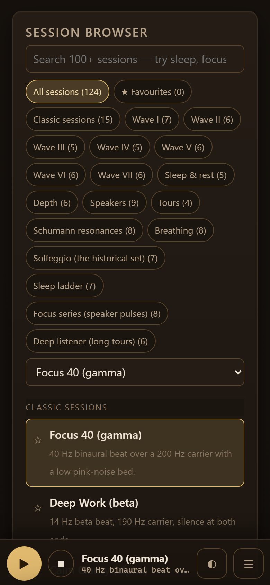
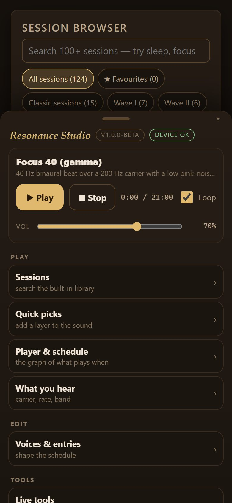
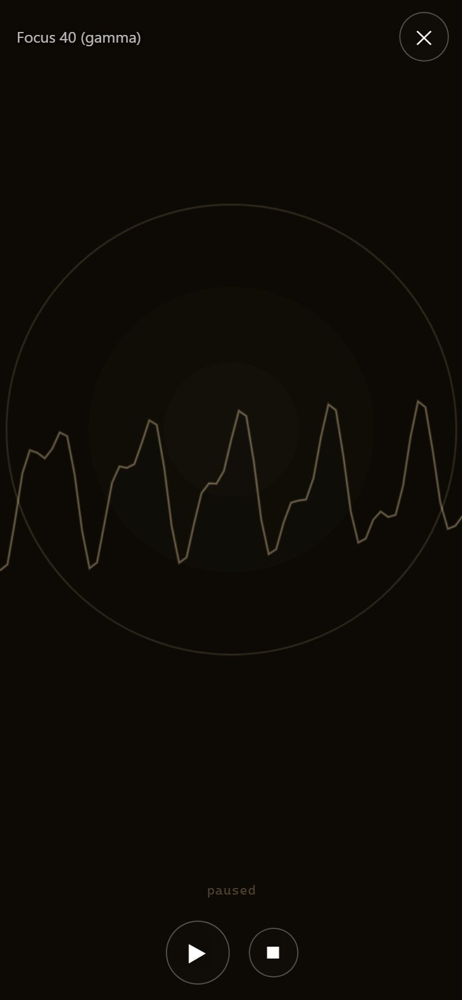
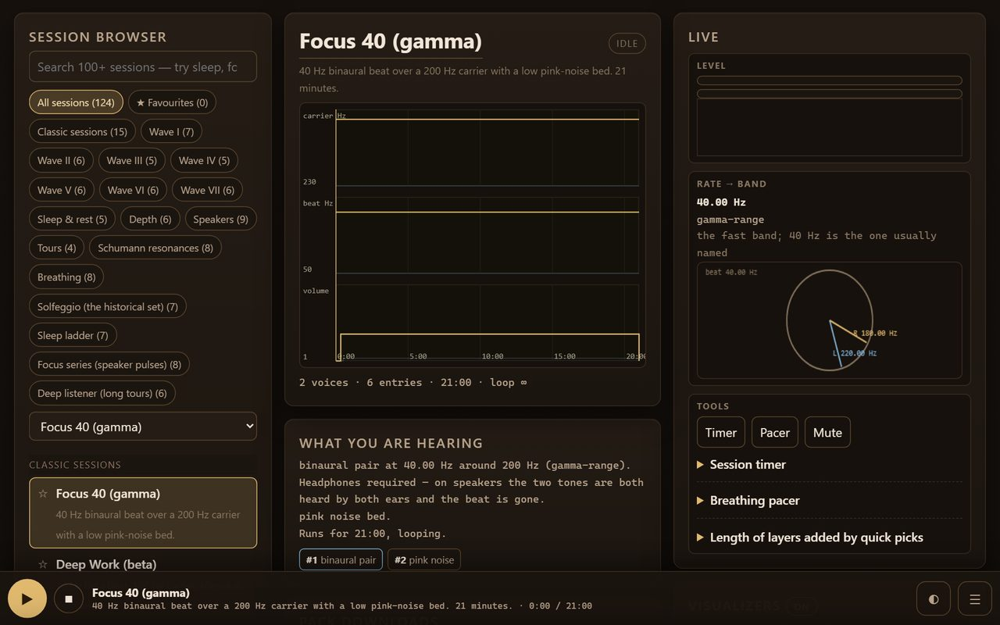

# Resonance Studio — Android

**The tone, beat and noise studio, in your pocket.** Resonance Studio's web app, wrapped in the
Android shell it never had: it keeps playing with the screen off, puts the session on your lock
screen, and reworks the studio's three-column desktop face for a phone — a player bar that
follows you, a menu that names every corner of the app, and a fullscreen visualizer with a
small play/pause at the bottom.

The web app itself is untouched. The bundled copy is byte-identical to what `moddys.net/resonance`
serves — the build checks every file against a manifest — so when the site changes, re-sync,
rebuild, and you have the new version.

## Screenshots

The Android build, captured from the app itself:

  



## What it does

- **One player bar, always there.** Play/pause, stop, the session name, the clock, the
  fullscreen-visualizer button and the menu, pinned across the bottom. The page's own
  three-row desktop header is hidden; its controls stay live and are what the bar drives,
  so there is exactly one source of truth for the sound.
- **A menu that explains the studio.** Drag the bar up (or tap the title) and a sheet lists
  every part of the app in plain words — Sessions, Quick picks, the schedule graph, what you
  are hearing, Voices & entries, Live tools (meter · timer · pacer · mute), Files & export,
  Pack downloads, the visualizer, skins, focus mode — and jumps to it. Plus the Quick guide,
  the device check and the update check.
- **Fullscreen visualizer.** Tap any visual panel — or the ◐ button — and it fills the screen
  with a small translucent play/pause embedded at the bottom. Tap the picture to hide the
  controls; the back button or the X returns. The panels are the site's own, with its own
  flash caps, and stay switch-off-able.
- **Keeps playing, screen off.** A `mediaPlayback` foreground service and a partial wake lock
  keep the session alive when you leave the app or lock the screen; the notification and the
  lock screen get pause and stop. The service asks for **no audio focus** — the WebView's own
  engine does that, exactly once per app, the same lesson the World Radio apps settled on
  after three releases of learning it the hard way.
- **A stop with a way back.** Pause keeps the notification with a Play button. A session that
  finishes on its own (or is paused in the app) lands on that same paused notification, never
  on a claim about why. Swiping the app away ends the session, as it must - the WebView dies
  with the task.
- **Files a phone can live with.** `Open .gnaural` and `Add pack (.zip)` import through the
  system picker. `Save .gnaural`, `Export WAV` (any length — the shell streams in chunks, so a
  full-length WAV is fine) and every **Pack download** land in `Downloads/Resonance Studio`.
  Pack zips are bundled, so that part works with no network at all.
- **Share links that work.** `Copy share link` builds the site address — the shell rewrites
  the app's private origin to `moddys.net/resonance` — so the link opens anywhere, including
  this app's own page on the web.
- **Offline by default.** The whole studio — engine, worklet, sessions editor, visualizers
  and all 19 pack archives — is inside the APK. The only network use is the update check and
  the help/credits pages, which open in the phone's browser.
- **The same data, saved properly.** Preferences, favourites and imported packs live in the
  usual `localStorage`, and imports are real files the studio already knows how to read.
- **Touch-correct.** No double-tap zoom, no tap highlights, no rubber-band bounce; safe-area
  padding under the bar and in the sheet; every bar control is a 44 px-plus target.
- **Three skins, dark to light.** Forge, nocturne and paper, from the menu — the bar and the
  sheet follow the skin's tokens.

## Quick start

The build runs in GitHub Actions, so you don't need the Android SDK on your machine.

1. Push this repo (or open **Actions → Build APK → Run workflow**).
2. Download the **resonance-debug-apk** artifact when it goes green — or, for a real
   install, tag `v*` and take the signed APK from the Release.
3. Copy the `.apk` to your phone and open it, allowing "install unknown apps" for your file
   manager when prompted. Android will warn about unknown developers — that is the sideload
   flow, not a problem with the build.

The signed APK is also on the site's downloads hub — **moddys.net/moddys-downloads.html** —
and the site's copy and the GitHub release asset are the same bytes.

Note: the debug artifact is a **different package** (`…​.debug`) signed with the CI debug key.
It is for testing; uninstall it before installing a signed release, or you will have two apps.

To build locally instead you need JDK 17 and the Android SDK (`platforms;android-34`,
`build-tools;34.0.0`), then:

```bash
gradle :app:assembleDebug        # -> app/build/outputs/apk/debug/app-debug.apk
```

## Refreshing the bundled web app

The studio under `app/src/main/assets/www/` is a snapshot, plus a manifest
(`assets-manifest.json`) with a sha256 per file — CI checks the tree against the manifest
before every build, so a hand-edit cannot slip out unrecognised. After the site changes:

```bash
python tools/sync-assets.py            # copy from C:\Users\Moddy\webmusic-hub\site\resonance
python tools/sync-assets.py --from-url # or pull whatever is live on moddys.net
python tools/sync-assets.py --check    # or just check for drift
```

Then commit the changed files. The CI workflow can also do the pull for you: run
**Build APK** from the Actions tab with `sync_from_site` checked. (The **release** workflow
never re-syncs: it ships exactly what is committed, so a release is reproducible.)

## How it fits together

| file | role |
|---|---|
| `MainActivity.java` | hosts the web app in a WebView, serves its files from the APK, injects `_shell_shim.js` after each load, opens the system file picker, streams saves to Downloads, routes external links to the phone's browser |
| `PlaybackService.java` | foreground service + `MediaSession` + notification; never touches audio itself |
| `Compat.java` | reads `compat.json`, decides whether this device is supported, shows the one-time notice |
| `Updates.java` | asks `moddys.net/updates.json` (the `resonance-android` entry) and installs a newer APK through DownloadManager, checksum verified before the installer sees it |
| `assets/www/_shell_shim.js` | the only new front-end code: the player bar, the menu sheet, the fullscreen visualizer, save/clipboard/link plumbing, and state reporting |
| `assets/www/compat.json` | the version thresholds the notice, the Check panel and the website all read |
| `tools/sync-assets.py` | copies the site into `assets/www/` and writes the manifest |
| `tools/shim_harness.py` | drives the shim against the real page in a real browser — the acceptance gate |

**The app has its own origin.** The page is served from
`https://appassets.androidplatform.net/app/index.html`, with every request answered from the
APK's assets. Not a detail: the studio's audio boot `fetch()`es `engine.js` and
`worklet-processor.js` to build its AudioWorklet module, which a `file://` origin cannot do —
and an https origin is a secure context, so the worklet path works exactly as it does on the
site. The WebView never talks to the network for its own files, and external links are handed
to the phone's browser rather than followed.

### The shell is coupled to the page's markup, on purpose

It does not reimplement playback — every action goes through the page's own API and DOM:
`window.__gnauralAPI` (`play`/`pause`/`togglePlay`/`stopPlayback`/`setMaster`/`toast`/`state`/
`toGnauralText`), and the elements `#plist`, `#search`, `#quickpick`, `#graph`, `#hearinfo`,
`#voicelist`, `#timerBtn`, `#vizCard`, `#pklist`, `#saveGnm`, `#shareBtn`, `#loadBtn`,
`#master`, `#loop`, `#skin`, `#focusBtn`, `#nowtitle`, `#nowsrc`, `#clock`, `#modePill`, the
`[data-viz-host]`/`[data-viz-panel]` panels and the footer's site links. If the web app ever
renames those, the shell needs the matching edit — one place, and the harness catches it.

## Compatibility

| | |
|---|---|
| Android | **8.0 (API 26) and newer**; `targetSdk 34` |
| Tuned for | **Android 11 (API 30)** and newer — below it, the app says so at launch and points at the Check panel |
| Installing on something older | Android's own installer refuses: the APK declares `minSdkVersion 26` |
| Audio | synthesised in the device's **Android System WebView**; its version, not the Android version, decides whether you get AudioWorklet or the slower script fallback (the Check panel reports which) |
| No WebView at all | the app says so and tells you what to install, instead of crashing |

## Known limitations (v1.0.0-beta)

- **This first release installs by hand** (like any first release). Every later version
  updates itself: one tap on **Update now** in the app, with the download checksum-verified
  against the site's feed (`resonance-android` in `moddys.net/updates.json`) before Android
  asks to install it.
- **Swiping the app away ends the session.** That is Android: the WebView (and its audio) die
  with the task — the notification goes with it rather than lying about it.
- **Help, credits and the licence pages open in the phone's browser** (the site's full help is
  not bundled). The in-app Quick guide covers the essentials offline.
- **Aggressive OEM battery savers** (Xiaomi, some Samsungs) may still cut a backgrounded
  session; the foreground service and wake lock are the standard defence, and the Check panel
  exists to make a device report actionable when one misbehaves.

## Privacy & safety

Nothing is collected and nothing is uploaded; the app has **no analytics, no ads and no
third-party SDKs** — zero dependencies beyond Android's own WebView, MediaSession and
Notification APIs. The whole studio is synthesised on the device, so nothing streams; the only
network traffic the app itself makes is the update check (an HTTPS GET of one JSON file).
Cleartext HTTP is not permitted anywhere in the app.

Headphones for binaural sessions — the beat happens in your hearing, not the file; the Speakers
pack and the isochronic pulses are made for loudspeakers. Keep volumes moderate: a pulse train
is more alerting than a steady tone, and if you have to raise your voice to be heard at arm's
length it is too loud. If you have epilepsy or a seizure disorder, ask a clinician before using
repetitive pulsed tones. Skip it while driving or operating machinery, and stop if it feels
unpleasant. Not a medical device or treatment.

Cheers Moddy !
